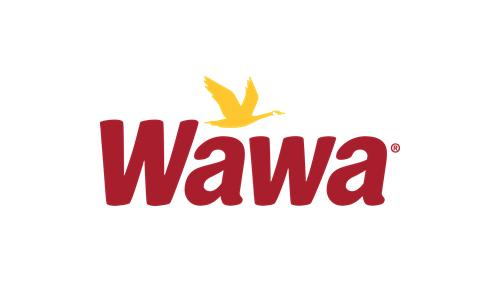
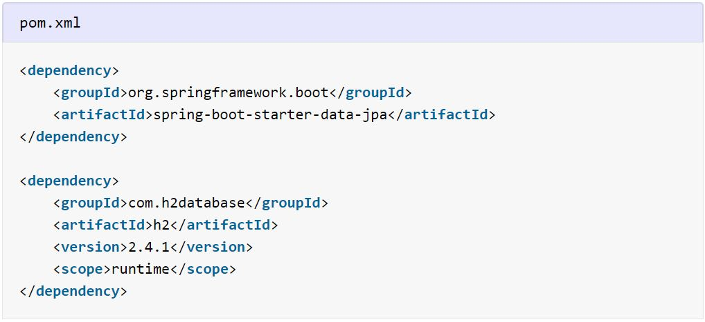
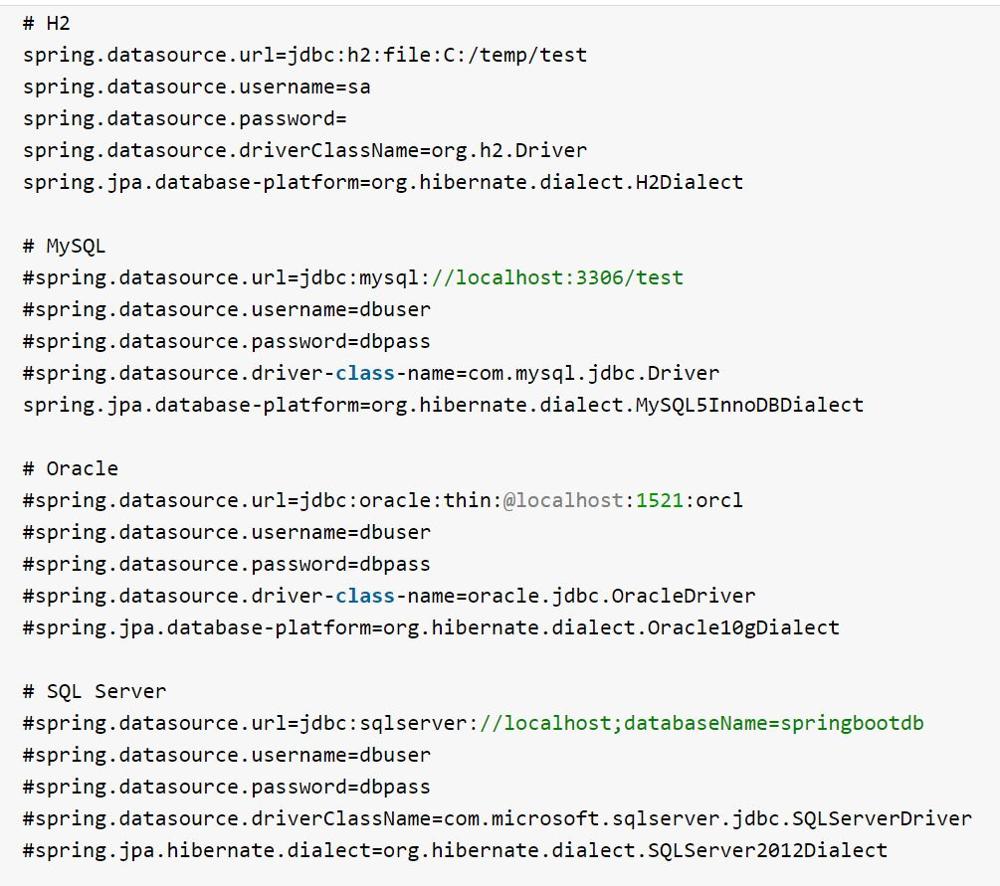
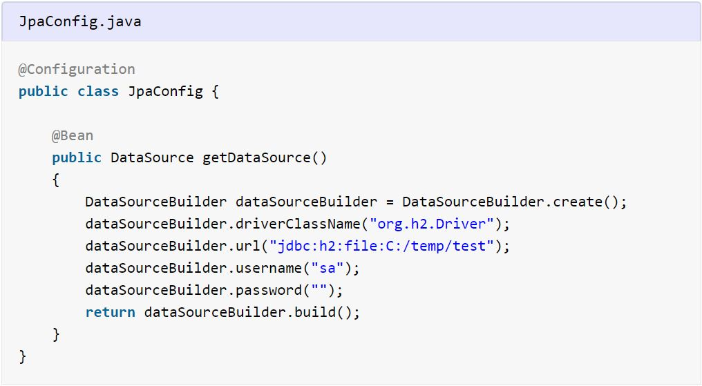
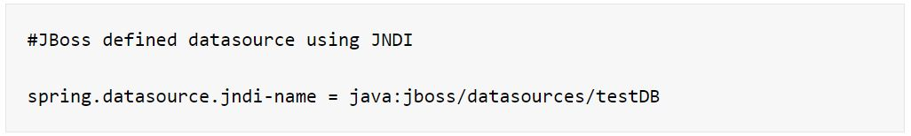
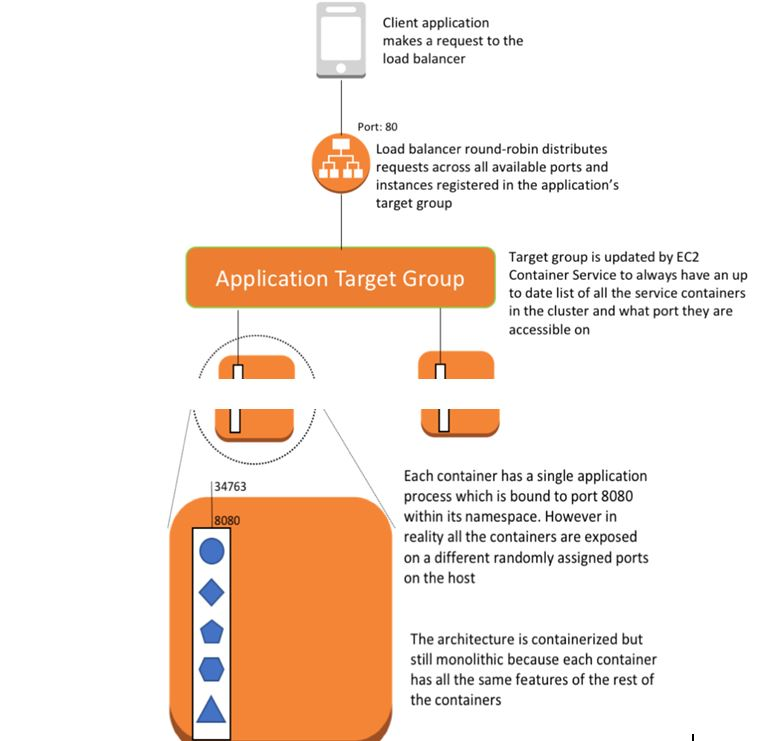
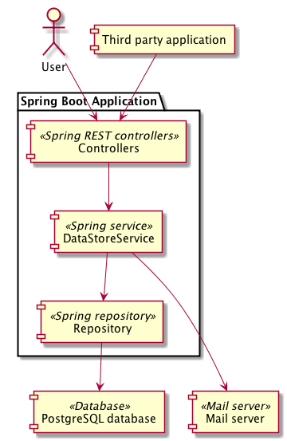

[](https://travis-ci.org/openmrs/openmrs-core) [](https://coveralls.io/github/openmrs/openmrs-core?branch=master) [](https://www.codacy.com/app/openmrs/openmrs-core?utm_source=github.com&amp;utm_medium=referral&amp;utm_content=openmrs/openmrs-core&amp;utm_campaign=Badge_Grade)

# Anonymous Token Generator


#### Table of Contents

1. [Introduction](#Introduction)
2. [Prerequisites](#prerequisites)
   1. [Tools](#Tools)
   2. [Infrastructure](#Infrastructure)
     1. [Local](#Local)
     2. [Cloud](#Cloud)
2. [Build And Deployment](#Build-And-Deployment)
   1. [Local Machine](#Local-Machine)
		1. [Dependencies](#Dependencies)
		2. [Configuration](#Configuration)
			- [Environment Variables](#Environment-Variables) 
			- [Data Source](#Data-Source)
			- [Logging](#Logging)
			- [Message Bus](#Message-Bus)	
		3. [Build Instructions](#Build-Instructions)
		4. [Testing Instructions](#Testing-Instructions)
		5. [Deployment Instructions](#Deployment-Instructions)
	2. [Local Integration Environment](Local-Integration-Environment)
		1. [Dependencies](#Dependencies)
		2. [Configuration](#Configuration)
			- [Environment Variables](#Environment-Variables) 
			- [Data Source](#Data-Source)
			- [Logging](#Logging)
			- [Message Bus](#Message-Bus)	
		3. [Build Instructions](#Build-Instructions)
		4. [Testing Instructions](#Testing-Instructions)
		5. [Deployment Instructions](#Deployment-Instructions)
	3. [Integration Platform](Integration-Platform)
		1. [Dependencies](#Dependencies)
		2. [Configuration](#Configuration)
			- [Environment Variables](#Environment-Variables) 
			- [Data Source](#Data-Source)
			- [Logging](#Logging)
			- [Message Bus](#Message-Bus)	
		3. [Build Instructions](#Build-Instructions)
		4. [Testing Instructions](#Testing-Instructions)
		5. [Deployment Instructions](#Deployment-Instructions)
3. [Design Details](#Design-Details)
	1. [UML Diagrams](#UML-Diagrams)
	2. [Events Produced And Events Consumed](#Events-Produced-And-Events-Consumed)
	3. [Dependent Downstream Services](#Dependent-Downstream-Services)
4. [Support](#Support)
   1. [Deployment status](#Deployment-status)
   2. [How to view Health statistics](#How-to-view-Health-statistics)
   3. [How to view Logs](#How-to-view-Health-statistics)
   4. [Owned by which Team?](#Owned-by-which-Team?)
5. [References](#References)
    1. [Links to Detailed Design](#Links-to-Detailed-Design)
    2. [Links to SBBs used](#Links-to-SBBs-used)
    3. [Links to ABBs used](#Links-to-ABBs-used)
    4. [Links to OAS on Developer Portal](#Links-to-OAS-on-Developer-Portal)
    5. [Links to On-boarding document](#Links-to-On-boarding-document)
6. [License](#license)


## Introduction
Anonymous Token Generator using Spring Security-To produce detailed design for creating, signing, validating and consuming JWT Tokens, so that Anonymous Customers can Order Online and/or Managing Orders, using web/mobile applications.
## Prerequisites
### Tools (to be installed on developer’s machine)
   #### Java

Install Java8 (https://www.oracle.com/java/technologies/java8.html).
If you want to build the master branch you will need a Java JDK of minimum version 8.

   #### Maven

Install the build tool [Maven](https://maven.apache.org/).

You need to ensure that Maven uses the Java JDK needed for the branch you want to build.

To do so execute

```bash
mvn -version
```

which will tell you what version Maven is using. Refer to the [Maven docs](https://maven.apache.org/configure.html) if you need to configure Maven.

   #### Git

Install the version control tool [git](https://github.com/wawa/) and clone this repository with

```bash
git clone  https://github.com/wawa/admin-toolstack-config.git
```

### Infrastructure
 - **Local**
      [ Appliation Infrastructure ](https://wawaappdev.atlassian.net/wiki/spaces/KM/pages/350554432/Application+Infrastructure)
 - **Cloud**
     A key component of the integration platform (IP) is the Amazon cloud (AWS).  Along with infrastructure as a service (IIS) the cloud platform maintains identity and access management (IAM) for their platform to ensure the services used are used in a secure fashion.
   [ Cloud Configuration ](https://wawaappdev.atlassian.net/wiki/spaces/KM/pages/325943364/Cloud+Configuration)
## Build And Deployment

### Local Machine
   - **Dependencies** 
   ```
		<parent>
		<groupId>org.springframework.boot</groupId>
		<artifactId>spring-boot-starter-parent</artifactId>
		<version>2.1.9.RELEASE</version>
		<relativePath/> <!-- lookup parent from repository -->
		</parent>
```
		
 - **Configuration**
  #### Environment Variables
   ##### [Local Machine Environment Variables ](https://wawaappdev.atlassian.net/wiki/spaces/KM/pages/328799449/Application+Configuration+Management#ApplicationConfigurationManagement-Environmentvariables)
  
  
  
  
  
 #### Data Source
  ##### Maven Dependencies
  
  
 
 
  ##### application.properties
  
DataSource configuration is provided by external configuration properties ( spring.datasource.* ) in application.properties file.
the properties configuration decouple the configuration from application code. This way, we can import the datasource configurations from even 				       configuration provider systems.
Below given configuration shows sample properties for H2, MySQL, Oracle and SQL server databases.

				
 ##### DataSource Bean
 
Recommended way to create DataSource bean is using DataSourceBuilder class within a class annotated with the @Configuration annotation. The 				    datasource uses the underlying connection pool as well.
 

				
##### JNDI DataSource
If we deploy your Spring Boot application to an Application Server, we might want to configure and manage the DataSource by using the 					Application Server’s built-in features and access it by using JNDI.
We can do this using the spring.datasource.jndi-name property. e.g.


								
  #### Logging
  [Logging](https://wawaappdev.atlassian.net/wiki/spaces/ENTERPRISE/pages/337379586/ST9.1.1-+Logging+Standard+-+Java)
    
  #### Message Bus
  [Message Bus](https://wawaappdev.atlassian.net/wiki/spaces/ENTERPRISE/pages/334302909/Decision+What+should+Wawa+s+message+bus+architecture+look+like)

- **Build Instructions**
		After you have taken care of the [Prerequisites](#prerequisites)

		Execute the following

			```bash
			cd openmrs-core
			mvn clean package
			```

- **Testing Instructions**
		
    #### Unit test cases
     There are multiple unit test cases written to cover the different components of the application. However there is a global application test suite file _**UnitTests.java**_ that combines all the test cases in a logical manner to create a complete suite. It can be run from command prompt using the following command -

````
mvn clean test -Dtest=ApplicationUnitTests
````


- **Deployment Instructions**
		
For development purposes you can simply deploy the `* .war` into the application server

   [More Information](http://webhelp.esri.com/arcgisserver/9.2/java/manager/applications/deploying_to_websphere.htm)
   


If all goes well (check the console output) you can access the OpenMRS application at `localhost:8080/openmrs`.

Refer to [Getting Started as a Developer - Maven](https://wiki.openmrs.org/display/docs/Maven) for some more information
on useful Maven commands and build options.


 ### Local Integration Environment
  - **Dependencies** 
   ```
		<parent>
		<groupId>org.springframework.boot</groupId>
		<artifactId>spring-boot-starter-parent</artifactId>
		<version>2.1.9.RELEASE</version>
		<relativePath/> <!-- lookup parent from repository -->
		</parent>
```
		
 - **Configuration**
  #### Environment Variables
  
  [Environment Variables ](https://wawaappdev.atlassian.net/wiki/spaces/KM/pages/328799449/Application+Configuration+Management#ApplicationConfigurationManagement-Environmentvariables)
  
  
  
  
  
  
			
  #### Data Source
  
  
  
  
  
  
  
 ##### Maven Dependencies
 
 
##### application.properties
DataSource configuration is provided by external configuration properties ( spring.datasource.* ) in application.properties file.
The properties configuration decouple the configuration from application code. This way, we can import the datasource configurations from even 				       configuration provider systems.Below given configuration shows sample properties for H2, MySQL, Oracle and SQL server databases.
				
#####  DataSource Bean

Recommended way to create DataSource bean is using DataSourceBuilder class within a class annotated with the @Configuration annotation. The 				    datasource uses the underlying connection pool as well.


##### JNDI DataSource
If we deploy your Spring Boot application to an Application Server, we might want to configure and manage the DataSource by using the 					Application Server’s built-in features and access it by using JNDI.We can do this using the spring.datasource.jndi-name property. e.g.
				
#### Logging
[Logging](https://wawaappdev.atlassian.net/wiki/spaces/ENTERPRISE/pages/337379586/ST9.1.1-+Logging+Standard+-+Java)
#### Message Bus
[Message Bus ](https://wawaappdev.atlassian.net/wiki/spaces/ENTERPRISE/pages/334302909/Decision+What+should+Wawa+s+message+bus+architecture+look+like)
			
- **Build Instructions**
		
		```Build Instructions for Local Integration environment
			```
			
- **Testing Instructions**

```Test Instructions for Local Integration environment```

		
#### Unit test cases
There are multiple unit test cases written to cover the different components of the application. However there is a global application test suite file _**UnitTests.java**_ that combines all the test cases in a logical manner to create a complete suite. It can be run from command prompt using the following command -

````
mvn clean test -Dtest=ApplicationUnitTests
````


- **Deployment Instructions**

#### Deploy Microservice

[Deploying a Microservice Via an automated CI/CD Pipeline](https://wawaappdev.atlassian.net/wiki/spaces/EE/pages/659751676/SBB+-+BE+Deploy+Microservice)

#### Deploy UI Web App
[Deploying UI Web App](https://wawaappdev.atlassian.net/wiki/spaces/EE/pages/660046657/SBB+-+FE+Deploy+UI+Web+App)

#### Deploying a Microservice to Docker Container
[Deploying a Microservice to Docker Container](https://www.javainuse.com/devOps/docker/docker-jar)


### Integration Platform
  - **Dependencies** 
   ```
		<parent>
		<groupId>org.springframework.boot</groupId>
		<artifactId>spring-boot-starter-parent</artifactId>
		<version>2.1.9.RELEASE</version>
		<relativePath/> <!-- lookup parent from repository -->
		</parent>
```
		
 - **Configuration**
  #### Environment Variables
  
  [ Environment Variables ](https://wawaappdev.atlassian.net/wiki/spaces/KM/pages/328799449/Application+Configuration+Management#ApplicationConfigurationManagement-Environmentvariables)
  
  
  
  
  
  
			
  #### Data Source
  
  
  
  
  
  
  
 ##### Maven Dependencies
 
 
 
 ##### application.properties
DataSource configuration is provided by external configuration properties ( spring.datasource.* ) in application.properties file.
The properties configuration decouple the configuration from application code. This way, we can import the datasource configurations from even 				       configuration provider systems.Below given configuration shows sample properties for H2, MySQL, Oracle and SQL server databases.

				
##### DataSource Bean
  
  Recommended way to create DataSource bean is using DataSourceBuilder class within a class annotated with the @Configuration annotation. The 				    datasource uses the underlying connection pool as well.
  
  

				
				
##### JNDI DataSource
If we deploy your Spring Boot application to an Application Server, we might want to configure and manage the DataSource by using the 					Application Server’s built-in features and access it by using JNDI.
We can do this using the spring.datasource.jndi-name property. e.g.				

				

#### Logging
 [Logging](https://wawaappdev.atlassian.net/wiki/spaces/ENTERPRISE/pages/337379586/ST9.1.1-+Logging+Standard+-+Java)

#### Message Bus
[Message Bus](https://wawaappdev.atlassian.net/wiki/spaces/ENTERPRISE/pages/334302909/Decision+What+should+Wawa+s+message+bus+architecture+look+like)

- **Build Instructions**
		

		

			```Build Instructions for  Integration environment
			```

- **Testing Instructions**
		
		```
		LocaL Test Integration Steps
			```


- **Deployment Instructions**

		
[Deploying Microservie to AWS Cloud](https://aws.amazon.com/blogs/compute/deploying-java-microservices-on-amazon-ec2-container-service/)

##### Container deployment overview



## Design Details
#### UML Diagrams


#### Events Produced And Events Consumed
[Event Publisher](https://wawaappdev.atlassian.net/wiki/spaces/ENTERPRISE/pages/593334289/Solution+Building+Block+-+Event+Publication)

[Event Subscriber](https://wawaappdev.atlassian.net/wiki/spaces/ENTERPRISE/pages/579338621/Solution+Building+Block+-+Event+Subscriber)
#### Dependent Downstream Services
[Dependencies](https://wawaappdev.atlassian.net/wiki/spaces/EE/pages/762448353/Dependencies+on+EE+Team+s)

## Support

   #### Deployment status
   [Deployment status](https://wawaappdev.atlassian.net/wiki/spaces/KM/pages/857768982/Component+Onboarding+and+Deployment+Status)
   #### How to view Health statistics
   [Health Checks](https://wawaappdev.atlassian.net/wiki/spaces/KM/pages/252937977/Application+Health+Checks)
   #### How to view Logs
   [Amazon S3 Logs](https://docs.datadoghq.com/integrations/amazon_s3/#enable-s3-access-logs)
   
   #### Owned by which Team?
   [Team Details](https://wawaappdev.atlassian.net/wiki/spaces/EE/pages/696322608/EE+Agile+Teams)
   
## References
Includes documents which are linked with JIRA stories
[Links](https://wawaappdev.atlassian.net/secure/RapidBoard.jspa?rapidView=280)
#### Links to Detailed Design
[Detailed Design]()
#### Links to SBBs used
[Link(s) to SBBs](https://wawaappdev.atlassian.net/wiki/spaces/EE/pages/586613993/P3%2B-%2BSolution%2BBuild%2BBlock%2BRegistry)
#### Links to ABBs used
[Link(s) to ABBs](https://wawaappdev.atlassian.net/wiki/spaces/ENTERPRISE/pages/508428401/Foundational+Architecture+Building+Blocks)
#### Links to OAS on Developer Portal
[Link to OAS on Developer Portal](https://wawaappdev.atlassian.net/wiki/spaces/ENTERPRISE/pages/590742573/System+Developer+Portal+Design)
#### Links to On-boarding document
[Developer On-boarding](https://wawaappdev.atlassian.net/wiki/spaces/MEET/pages/131137606/Developer+onboarding)

## License

[Engineering Team3](https://wawaappdev.atlassian.net/secure/RapidBoard.jspa?rapidView=280&projectKey=EN3) © [WAWA](https://www.wawa.com/)
